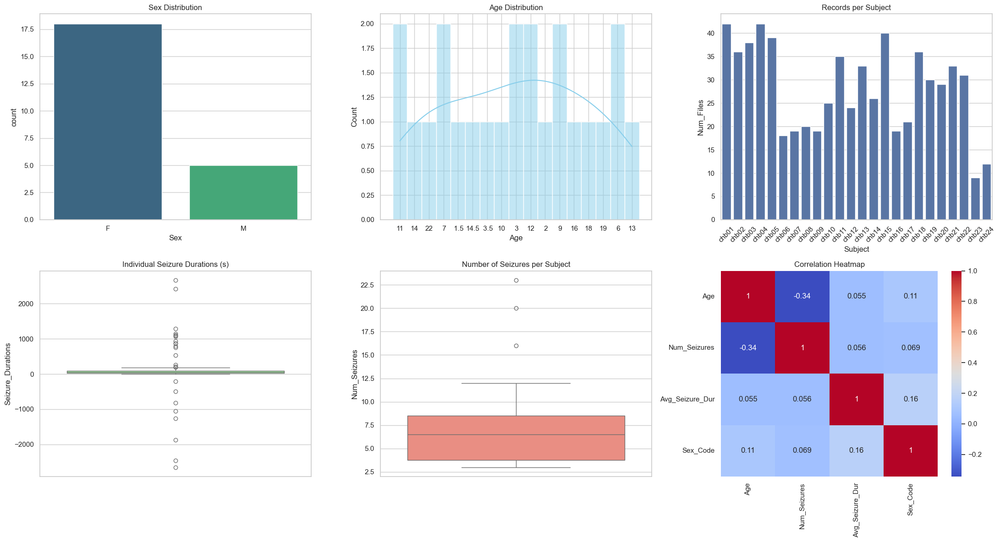

# Data Collection Process
Since the whole dataset is quite large and contains a lot of patients and data and the site takes about 20 minutes to download each edf file, we decided to select a subset of data to use for our analysis.

1. [Analyse the dataset info provided](#data-information-retrieval-and-analysis)
2. [Select specific patients based on the meta-analysis](#dataset-selection)
3. [Select specific EEG channels based on papers](#channel-selection)
4. [Process the selected data](#signal-processing)
    - [Filtering](#filtering)
    - [Scaling](#scaling)
    - [Segmentation (Windowing)](#segmentation-windowing)
5. [Split the data into train, validation and test sets](#balancing--splitting)

## Data Information Retrieval and Analysis
[Notebook](../notebooks/collect_info.ipynb)

The first step is to retrieve and analyze the dataset information.
We will use the `SUBJECT-INFO.txt` file to understand the demographics and clinical characteristics of the patients, as well as the summary files for each patient to identify the timing and duration of seizures. This information will help us in selecting the appropriate subsets of data for our analysis and in understanding the distribution of seizure and non-seizure events across the patients.

## Dataset Selection
[Notebook](../notebooks/collect_info.ipynb)
Instead of using the whole dataset, we select specific patients based on the meta-analysis.

For each patient, we keep all files containing seizures and a subset of seizure-free files (maintaining a specific ratio where non-seizure time is greater than seizure time).

## Channel Selection
[Notebook](../notebooks/collect_info.ipynb)

Load only 2 or 3 specific EEG channels (e.g., based on the 10-20 system) as recommended by clinical literature to reduce dimensionality.

TODO

## Signal Processing

### Filtering

Apply a Bandpass filter (e.g., 0.5 - 40 Hz).

### Scaling

Use RobustScaler to handle EEG artifacts and outliers.

## Segmentation (Windowing)

Slice continuous signals into 10-second windows.

Label windows as 1 (Seizure) or 0 (Normal) based on the timestamps from metadata.

## Balancing & Splitting

Sub-sample the "Normal" windows to balance the classes (though keeping a higher proportion of normal data to remain realistic).

Perform a Subject-Independent or Subject-Specific split into Train, Validation, and Test sets.
