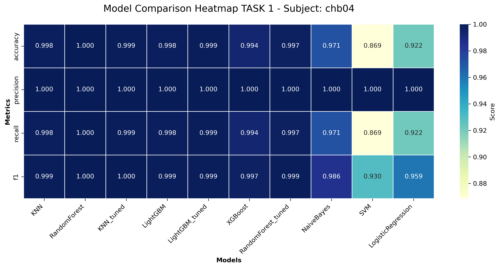
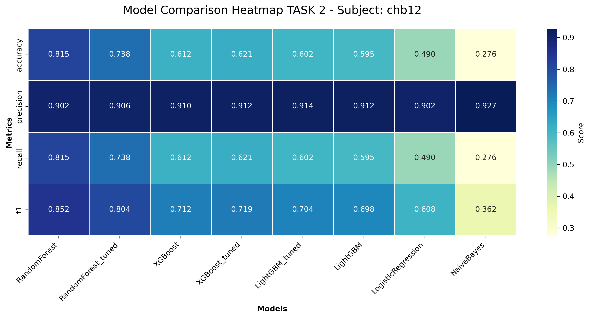
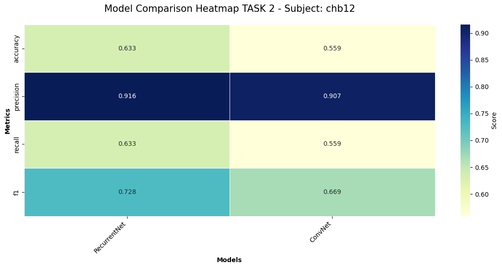
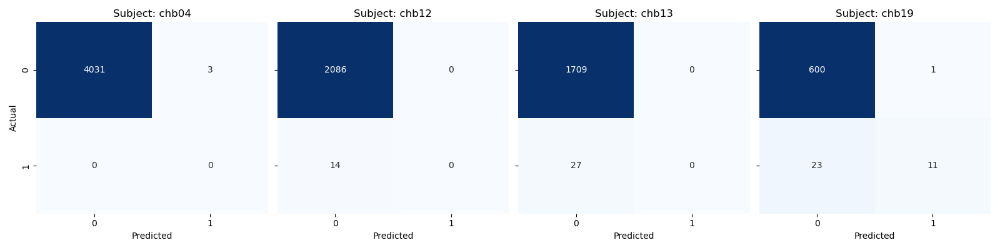
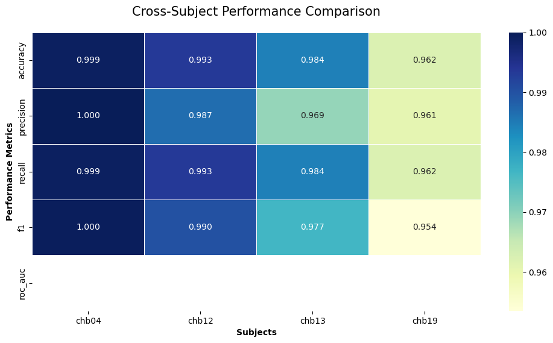
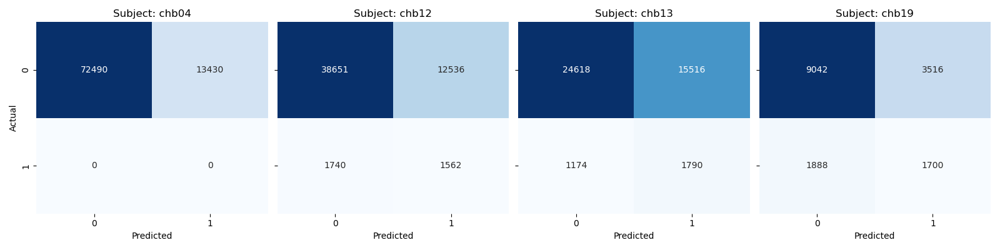
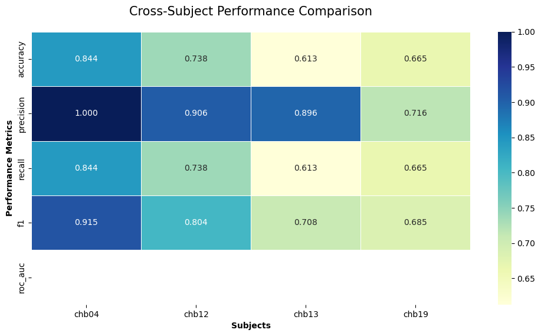
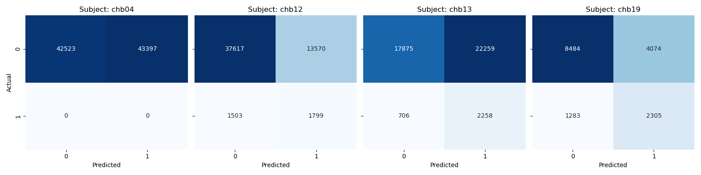
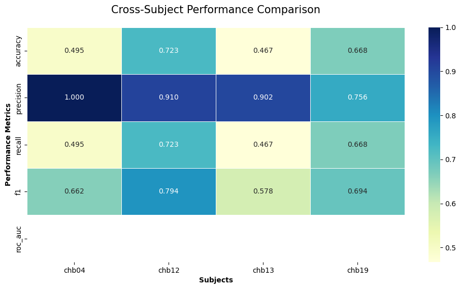

# Models Selection & Evaluation
In this phase of the project, we move from feature engineering to the implementation of a competitive modeling pipeline. We evaluate two distinct clinical objectives: **Seizure Detection (Task 1) and Seizure Forecasting (Task 2)**. 
_This document describes the multi-stage pipeline used to shortlist the best algorithms, the criteria for selecting training subjects, and a comprehensive cross-subject evaluation to test how well our models generalize to unseen patients of different ages and genders._

**Table of Contents**
1. [Models Selection](#models-selection)
    - [Pipeline](#pipeline)
    - [Models Selected Criterion](#models-selected-criterion)
        - [Task 1 (Detection)](#task-1)
        - [Task 2 (Forecasting)](#task-2)

2. [Cross-Subject Evaluation](#cross-subject-evaluation)
    - [K-Nearest Neighbor (Task 1)](#k-nearest-neighbor)
    - [RandomForest (Task 2 Baseline)](#randomforest)
    - [Recurrent Neural Network (Task 2 Deep)](#recurrent-neural-network)

3. [Conclusions](#conclusions)

## Models Selection

### Pipeline

The model selection process follows a structured **competition-based pipeline** designed to move from broad exploration to specialized optimization. Here is a synthetic breakdown of the workflow:

1. **Multi-Paradigm Baseline Screening**

    Instead of testing a single algorithm, the pipeline evaluates **more distinct models** simultaneously. These represent different mathematical families to ensure no predictive pattern is missed:

    * **Linear & Probabilistic**: Establish a low-complexity baseline (Logistic Regression, SVM, Naive Bayes).
    * **Non-Linear & Ensembles**: Capture complex decision boundaries (KNN, Random Forest, XGBoost, LightGBM).
    * **Temporal & Deep Learning**: Specifically target the sequential nature of EEG signals (HMM, 1D-CNN, RNN).

    > The models are always **imbalance aware** during training. Given that "pre-ictal" windows are rare events, models are not trained on raw accuracy. The pipeline implements **cost-sensitive learning** using `class_weights` and `scale_pos_weight`. This forces the algorithms to penalize missing a seizure (False Negative) more heavily than a false alarm.

2. **Metric-Driven Shortlisting**

    The "Winner" is not chosen by a single score. The selection logic filters the top performers through a two-step hierarchy:

    1. **Validation F1-Score**: Used to identify the **Top 3 models** that best balance Precision and Recall.
    2. **Recall (Sensitivity) Priority**: Since this is a medical safety task, models that favor Recall are prioritized to ensure the "early warning" actually triggers before a seizure.

3. **Automated Hyperparameter Optimization of the top 3 models**

    The shortlisted Top 3 models undergo **Randomized or Grid Search**. This fine-tunes their internal parameters (e.g., number of trees in a forest or learning rates in a neural network) to squeeze out the maximum predictive power for the specific subject’s brain morphology.

5. **Subject-Specific Pre-training & Export**

    The final "Best Model" is fully trained on the chronological split of the target subject (e.g., `chb12`). This optimized object is then exported as a `.joblib` file, preserving both the learned weights and the preprocessing scaling, ready for **Cross-Subject Generalization** testing.

### Models Selected Criterion
We evaluated our pipeline across two distinct tasks to cover the full spectrum of epilepsy monitoring:

- **Task 1 (Seizure Detection)**: Aimed at identifying the ictal state (active seizure) in real-time to trigger immediate emergency protocols.

- **Task 2 (Seizure Forecasting)**: Aimed at identifying the pre-ictal state (up to 10 minutes before onset) to provide a preventative "early warning" signal.

#### Task 1
[Notebook](../notebooks/models_task01/baseline_models.ipynb)

For the task 1 (seizure detection) subject `chb04` was chosen as the primary test case due to its balanced data availability, containing both **seizure-containing** and p**urely inter-ictal** files. This ensures a realistic evaluation of the _False Alarm Rate_.

The selected channel was identified via visual inspection as the lead with the highest signal-to-noise ratio and the most prominent electrical signatures during ictal transitions.

**Chosen Baseline Models: K-Nearest Neighbors**

The pipeline identified KNN as the optimal model for detection. After hyperparameter tuning, it achieved a perfect score on the test set. While this result is highly promising, it is partially influenced by the test set's high proportion of non-seizure data, confirming the model's exceptional ability to recognize normal background activity without triggering false positives.

> Since the hyperparameter-tuned KNN achieved maximum scores, the added complexity of deep learning would not have provided any significant performance gains, leading us to favor the more efficient baseline solution.

#### Task 2
[Notebook (baseline models)](../notebooks/models_task02/baseline_models.ipynb) and [Notebook (deep learning models)](../notebooks/models_task02/deep_models.ipynb)

Subject `chb12` was selected as the primary test case due to the _high frequency of seizure events recorded_ for this patient. This provides a statistically significant number of pre-ictal transitions, which is essential for training complex models and ensuring the generalizability of the forecasting results.

To further augment the training set, we implemented a channel-agnostic approach by **pooling data from all available channels**. Instead of focusing on a single lead, this 'explosion' of samples allows the models to learn more diverse spatial representations of the pre-ictal state, significantly increasing the volume of data available for the deep learning architectures.

**Chosen Baseline Model: Random Forest**

The pipeline selected Random Forest as the best classical performer. Its ensemble nature allowed it to maintain a high weighted precision (0.90), proving highly robust against the noise inherent in pre-seizure EEG signals.

**Chosen Deep Learning Model: Recurrent Neural Network**

The RNN was identified as the superior deep learning model. By utilizing its internal memory to process the temporal sequences leading up to a seizure, the RNN proved most capable of capturing the "dynamic" changes of the pre-ictal state that stationary models often miss.

## Cross-Subject Evaluation
The goal of this evaluation is to determine if a model trained on one individual can effectively monitor others. We import the pretrained/tuned models and run them against the unseen test sets of the entire patient cohort. In this report we decided to focus on Confusion Matrices to visualize error types and Heatmaps to compare weighted metrics across demographics.

### K-Nearest Neighbor
[Notebook](../notebooks/models_task01/comparison.ipynb)

These are realistic recordings. Since we use the final 15% of each patient's data for testing, many subjects have very few seizures in this period. This explains the strong class imbalance in the confusion matrices. Despite this, the model shows a solid ability to identify the **"Non-Seizure" (Inter-ictal)** class across all subjects.

The heatmap shows high performance because it uses `average='weighted'`. This metric is dominated by the **"Non-Seizure" class**, which represents the majority of the data. High scores here mean the model is excellent at identifying normal brain activity, but the gap between the two heatmaps proves that identifying the actual seizure onset remains the primary challenge.

The model generalizes best on `chb04` (Male, 22y), our training subject. Interestingly, performance drops significantly for `chb19` (Female, 19y) despite the similar age, suggesting that _gender or specific seizure morphology varies_.

Furthermore, the model performs very well on very young subjects like chb12 (Female, 2y) and chb13 (Female, 3y) in the weighted metrics, despite their different sex and age. This is a "false positive" sense of performance: because these specific test recordings contain almost no seizure events, the model achieves high accuracy simply by predicting "No Seizure" all the time. While it looks successful in the second plot, the first plot confirms it is _completely blind_ to the actual seizure patterns of toddlers.

### RandomForest
[Notebook](../notebooks/models_task02/base_mod_comparison.ipynb)

These are realistic recordings. Since we use the final 15% of each patient's data for testing, many subjects have few seizures and then few Pre-Ictal windows in this period. This explains the strong class imbalance in the confusion matrices. The model currently shows a slight bias toward **False Positives**, which in a real-world scenario would cause unnecessary patient stress by signaling "phantom" seizures. Conversely, the presence of **False Negatives** is a critical safety concern, as the system fails to warn the subject of an impending attack. While the model establishes a baseline, the trade-off between sensitivity and the false alarm rate needs further optimization to be clinically viable.

The heatmap provides a balanced view of the model's overall reliability. Here, we can see that the **Precision is significantly higher (around 0.90 in some subjects)**, which **positively affects the F1-score**. This means that when the model considers the entire recording (including the vast majority of normal activity) it is very accurate at not misclassifying the "Normal" state.

The model generalizes best on `chb04` (Male, 22y) and `chb12` (Female, 2y), our training subject. As expected, performance does not drop significantly for `chb13` (Female, 3y) given the similar age and same sex. This suggests that the model _generalizes effectively across similar subjects_, as the EEG morphology in early childhood follows consistent developmental patterns that the model was able to capture during training.

Furthermore, the model performs very well on `chb04`, but this is largely due to the **high volume of non-positive (Inter-Ictal)** labels present in the dataset. Because the test set is composed of 100% stable brain activity, the model achieves high weighted scores by correctly identifying these long periods of stability, even if it occasionally fails to catch the subtle transition to a seizure.

While the global **Precision is strong at 0.90** and other **weighted metrics hover around 0.70**, the model still struggles with the specific **"Pre-Ictal vs. Inter-Ictal"** discrimination. It is excellent at recognizing stability, but it needs further refinement to reduce false alarms and improve the specific detection of the 10-minute pre-seizure window. The current results indicate that while the model is a reliable "stability detector," it requires more sensitivity to the high-frequency changes or spectral shifts that characterize the immediate pre-seizure state.

### Recurrent Neural Network
[Notebook](../notebooks/models_task02/deep_mod_comparison.ipynb)

These are realistic recordings. Since we use the final 15% of each patient's data for testing, many subjects have few seizures and then few Pre-Ictal windows in this period. This explains the strong class imbalance in the confusion matrices. The model currently shows a strong bias toward **False Positives**, which in a real-world scenario would cause unnecessary patient stress by signaling "phantom" seizures. Conversely, the light presence of **False Negatives** is a critical safety concern, as the system fails to warn the subject of an impending attack. While the model establishes a baseline, the trade-off between sensitivity and the false alarm rate needs further optimization to be clinically viable.

The heatmap provides a balanced view of the model's overall reliability. Here, we can see that the **Precision is significantly higher (around 0.90 in the majority of the subjects)**, which **positively affects the F1-score**. This means that when the model considers the entire recording (including the vast majority of normal activity) it is very accurate at not misclassifying the "Normal" state.

The model generalizes best on `chb12` (Female, 2y), our training subject. Completely unexpected, despite the similar age and same sex, the performance drops significantly for `chb13` (Female, 3y). This suggests that the model does _not generalize effectively across similar subjects_, even in early childhood where EEG morphology is generally consistent. This indicates that seizure forecasting may be ***highly dependent on individual-specific "pre-seizure signatures" rather than general age-related brain patterns***. 

Conversely, this model performs relatively better on `chb19` (Female, 19y) compared to other non-training subjects. In contrast, it performs very poorly on `chb04` (Male, 22y). 

> We can conclude that ***Task 2 (Forecasting) is significantly more sensitive to gender and specific brain maturation than Task 1***. A model trained on a toddler (`chb12`) seems to retain some predictive power for a young female adult (`chb19`) but fails completely for a male adult (`chb04`), likely due to the vast differences in EEG amplitude and frequency distribution between these two demographics.

While the global **Precision is strong at 0.90** and other weighted metrics **hover around 0.70**, the model still **struggles with the specific "Pre-Ictal vs. Inter-Ictal" discrimination**. It is excellent at recognizing stability, but it needs further refinement, possibly through subject-specific calibration, to reduce false alarms and improve the specific detection of the 10-minute pre-seizure window.

## Conclusions
Our evaluation reveals a clear distinction between the two tasks. **Seizure Detection (Task 1) is a relatively stable problem** where classical models like KNN can achieve high accuracy by focusing on clear ictal signatures. However, **Seizure Forecasting (Task 2) remains a significant challenge**.

While our models achieved high Weighted Precision (0.90), proving they are excellent at recognizing "Normal" brain activity, **they struggle with the specific discrimination of the Pre-Ictal window**. The _cross-subject tests highlight that biological factors (age and gender) drastically change EEG morphology_, meaning a **universal forecaster is difficult to achieve without subject-specific calibration**. Future work should focus on reducing the False Positive rate to minimize patient stress while increasing sensitivity to the subtle spectral shifts that precede a seizure.