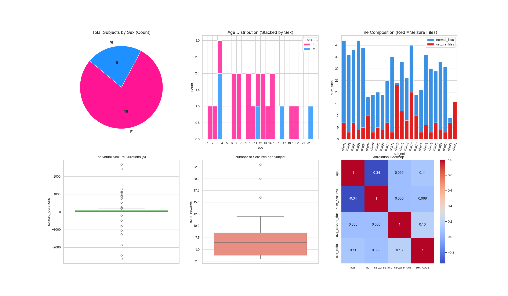
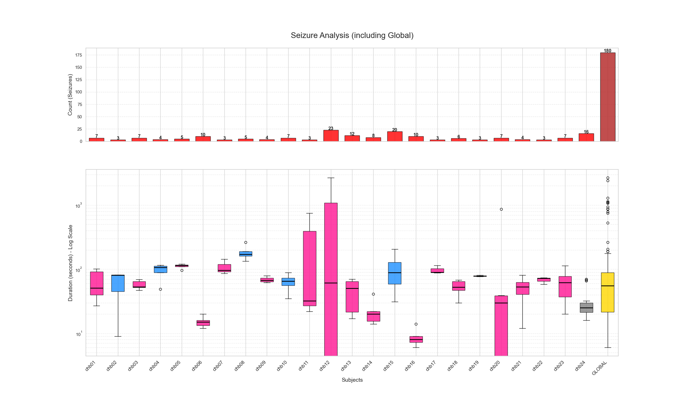

# Data Collection Process
Since the whole dataset is quite large and contains a lot of patients and data and the site takes about 20 minutes to download each edf file, we decided to select a subset of data to use for our analysis.

1. [Analyse the dataset info provided](#data-information-retrieval-and-analysis)
2. [Select specific patients based on the meta-analysis](#dataset-selection)
3. [Process the selected data](#signal-processing)
    - [Filtering](#filtering)
    - [Scaling](#scaling)
    - [Segmentation (Windowing)](#segmentation-windowing)
    - [Feature extraction](#feature-extraction)
    - [Labelling](#labelling)
5. [Split the data into train, validation and test sets](#balancing--splitting)

## Data Information Retrieval and Analysis
[Notebook](../notebooks/collection/collection.ipynb)

The first step is to retrieve and analyze the dataset information.
We will use the `SUBJECT-INFO.txt` file to understand the demographics and clinical characteristics of the patients, as well as the summary files for each patient to identify the timing and duration of seizures. This information will help us in selecting the appropriate subsets of data for our analysis and in understanding the distribution of seizure and non-seizure events across the patients.

The dataset is **quite biased**, with more females than males subjects and the age distribution is quite the same, we've about 1/2 subjects for each age (only age 3 has 3 subjects), covering an age range from 1.5 to 22 years old. 

The **seizure duration present a lot of outliers between all the patients**, even if all the patients have a median seizure duration of around 55 seconds, some patients have seizures that last more than 1000 seconds, and some strange duration less 0 seconds.

The **number of seizures per patient is quite constant**, with a median of around 6 seizures per patient, but some patients have more than 20 seizures. 

From the Correlation Heatmap is interesting notice how the **Age and Number of Seizures are negatively correlated, meaning that older a person is, less seizures they have**. From the same plot we can also notice that the **gender seems to influence the Average Seizure Duration, since females are 0 and males 1, the duration increase slightly in males** even if the males subjects are less than the females one.

To make the data selection process more intentional, we focused on seizure information. We used a log scale to visualize the data more clearly and to allow for an easier comparison between individual patients and the global seizure duration. The data shows that **seizure duration is highly individual**; some patients experience much longer seizures than others, a factor that is also influenced by the total number of seizures recorded for each person.

## Dataset Selection
[Notebook](../notebooks/collect_info.ipynb)

Instead of using the whole dataset, we select specific patients based on the meta-analysis (due the significant time to download them from the site, about 1.30h for each `.edf ` file). For each patient, we keep all files containing seizures and a subset of seizure-free files (maintaining a specific ratio where non-seizure time is greater than seizure time). This selection contains both seizure and non-seizure data, which is crucial for training effective classification models. The selected records are organized and stored in a structured format for subsequent preprocessing and analysis steps.

We decided to select four subjects based on our analysis of seizure durations. We excluded patient 24 because of missing demographic data (age and sex), even though this was the only patient with simultaneous ECG recordings. Our selection was based on age, sex, and seizure patterns:

- ***Subject 12*** was chosen because they have the highest number of recorded seizures and a duration profile that closely matches the global average, making them a key representative of the overall dataset.
- Since Subject 12 is a 2-year-old female, we paired her with ***Subject 13***, another girl of a similar age (3 years old).
- To ensure diversity in our sample, we also selected two older patients: ***Subject 4***, a 22-year-old male, and ***Subject 19***, a 19-year-old female.

## Signal Processing
[Notebook](../notebooks/data_preprocessing.ipynb)

The preprocessing phase automates the transformation of high-volume raw signals into structured datasets suitable for Machine Learning models.

### Filtering

- **Frequency Filtering**: a Band-pass filter (0.5 – 25 Hz) is applied to each record to eliminate high-frequency noise and low-frequency DC drift, focusing on the most relevant clinical EEG frequencies.

- **Artifact Removal**: the process includes a cleaning step to remove "ghost" channels (labeled `-` and empty) and redundant duplicated channels (such as `T8-P8`), considered as measurement errors, to ensure a unique and consistent input vector.

### Scaling

- **Robust Normalization**: signal amplitudes are scaled using `RobustScaler`. This method is chosen specifically for EEG data because it uses the interquartile range, making it resilient to outliers and high-amplitude artifacts commonly found in brain signal recordings.

## Segmentation (Windowing)

Continuous EEG signals are segmented into fixed-length blocks to prepare for supervised learning:

- **Window Size**: signals are sliced into windows defined by `WINDOW_SEC` (e.g., 5 or 10 seconds).

- **Overlapping**: to increase the number of available samples and capture transitional patterns between segments, an *overlap strategy* is implemented (the step size is calculated as `win_size * (1 - OVERLAP)`).

**Output Format**: The final data is stored as a 3D tensor with the shape `(number_of_windows, number_of_channels, window_samples)`.

### Feature Extraction
[Notebook]()

### Labelling
[Notebook](../notebooks/preprocessing/labeling.ipynb)

## Balancing & Splitting

Sub-sample the "Normal" windows to balance the classes (though keeping a higher proportion of normal data to remain realistic).

Perform a Subject-Independent or Subject-Specific split into Train, Validation, and Test sets.
 
---
## Channel Selection
[Notebook](../notebooks/data_preprocessing.ipynb)

Load only 2 or 3 specific EEG channels (e.g., based on the 10-20 system) as recommended by clinical literature to reduce dimensionality.

TODO