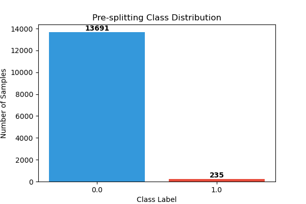
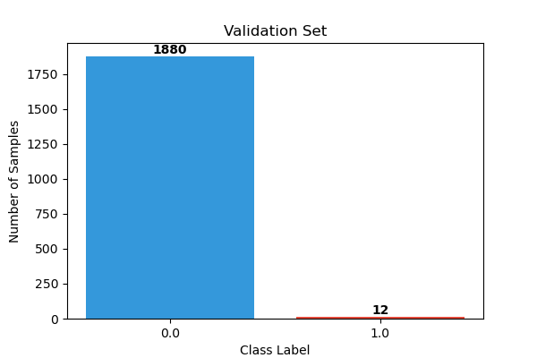
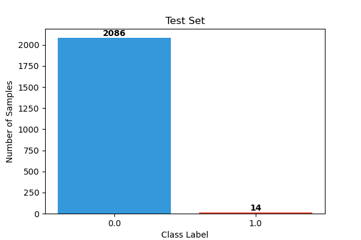
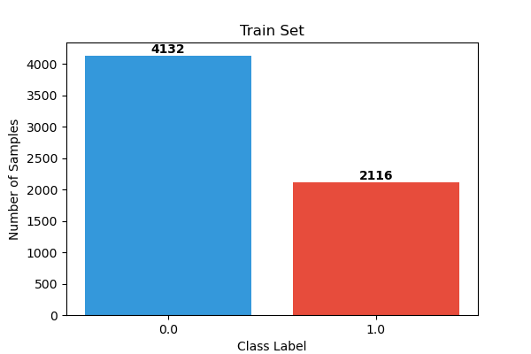
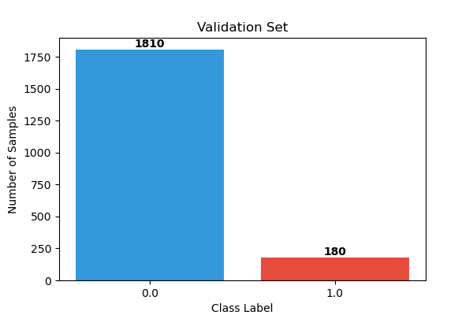
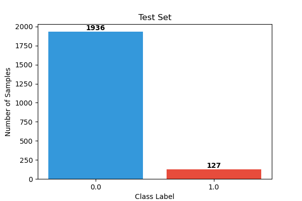

# Data Collection Process
Since the whole dataset is quite large and contains a lot of patients and data and the site takes about 20 minutes to download each edf file, we decided to select a subset of data to use for our analysis.

1. [Analyse the dataset info provided](#data-information-retrieval-and-analysis)
2. [Select specific patients based on the meta-analysis](#dataset-selection)
3. [Process the selected data](#signal-processing)
    - [Filtering](#filtering)
    - [Scaling](#scaling)
    - [Segmentation (Windowing)](#segmentation-windowing)
    - [Feature extraction](#feature-extraction)
    - [Labelling](#labelling)
5. [Split the data into train, validation and test sets](#balancing--splitting)

## Data Information Retrieval and Analysis
[Notebook](../notebooks/collection/collection.ipynb)

The first step is to retrieve and analyze the dataset information.
We will use the `SUBJECT-INFO.txt` file to understand the demographics and clinical characteristics of the patients, as well as the summary files for each patient to identify the timing and duration of seizures. This information will help us in selecting the appropriate subsets of data for our analysis and in understanding the distribution of seizure and non-seizure events across the patients.

The dataset is **quite biased**, with more females than males subjects and the age distribution is quite the same, we've about 1/2 subjects for each age (only age 3 has 3 subjects), covering an age range from 1.5 to 22 years old. 

The **seizure duration present a lot of outliers between all the patients**, even if all the patients have a median seizure duration of around 55 seconds, some patients have seizures that last more than 1000 seconds, and some strange duration less 0 seconds.

The **number of seizures per patient is quite constant**, with a median of around 6 seizures per patient, but some patients have more than 20 seizures. 

From the Correlation Heatmap is interesting notice how the **Age and Number of Seizures are negatively correlated, meaning that older a person is, less seizures they have**. From the same plot we can also notice that the **gender seems to influence the Average Seizure Duration, since females are 0 and males 1, the duration increase slightly in males** even if the males subjects are less than the females one.

To make the data selection process more intentional, we focused on seizure information. We used a log scale to visualize the data more clearly and to allow for an easier comparison between individual patients and the global seizure duration. The data shows that **seizure duration is highly individual**; some patients experience much longer seizures than others, a factor that is also influenced by the total number of seizures recorded for each person.

## Dataset Selection
[Notebook](../notebooks/collect_info.ipynb)

Instead of using the whole dataset, we select specific patients based on the meta-analysis (due the significant time to download them from the site, about 1.30h for each `.edf ` file). For each patient, we keep all files containing seizures and a subset of seizure-free files (maintaining a specific ratio where non-seizure time is greater than seizure time). This selection contains both seizure and non-seizure data, which is crucial for training effective classification models. The selected records are organized and stored in a structured format for subsequent preprocessing and analysis steps.

We decided to select four subjects based on our analysis of seizure durations. We excluded patient 24 because of missing demographic data (age and sex), even though this was the only patient with simultaneous ECG recordings. Our selection was based on age, sex, and seizure patterns:

- ***Subject 12*** was chosen because they have the highest number of recorded seizures and a duration profile that closely matches the global average, making them a key representative of the overall dataset.
- Since Subject 12 is a 2-year-old female, we paired her with ***Subject 13***, another girl of a similar age (3 years old).
- To ensure diversity in our sample, we also selected two older patients: ***Subject 4***, a 22-year-old male, and ***Subject 19***, a 19-year-old female.

## Signal Processing
[Notebook](../notebooks/data_preprocessing.ipynb)

The preprocessing phase automates the transformation of high-volume raw signals into structured datasets suitable for Machine Learning models.

### Filtering

- **Frequency Filtering**: a Band-pass filter (0.5 – 25 Hz) is applied to each record to eliminate high-frequency noise and low-frequency DC drift, focusing on the most relevant clinical EEG frequencies.

- **Artifact Removal**: the process includes a cleaning step to remove "ghost" channels (labeled `-` and empty) and redundant duplicated channels (such as `T8-P8`), considered as measurement errors, to ensure a unique and consistent input vector.

### Scaling

- **Robust Normalization**: signal amplitudes are scaled using `RobustScaler`. This method is chosen specifically for EEG data because it uses the interquartile range, making it resilient to outliers and high-amplitude artifacts commonly found in brain signal recordings.

### Segmentation (Windowing)

Continuous EEG signals are segmented into fixed-length blocks to prepare for supervised learning:

- **Window Size**: signals are sliced into windows defined by `WINDOW_SEC` (e.g., 5 or 10 seconds).

- **Overlapping**: to increase the number of available samples and capture transitional patterns between segments, an *overlap strategy* is implemented (the step size is calculated as `win_size * (1 - OVERLAP)`).

**Output Format**: The final data is stored as a 3D tensor with the shape `(number_of_windows, number_of_channels, window_samples)`.

### Feature Extraction
[Notebook](../notebooks/preprocessing/features_&_labels.ipynb)

Feature extraction is essential to transform high-dimensional raw EEG signals into a structured format that machine learning models can effectively interpret. This process preserves critical temporal and spectral characteristics while significantly reducing data complexity. To ensure scalability, we implemented a vectorized and parallelized extraction pipeline that maintains a low memory footprint.

**Feature Categories:**
- ***Time Domain Statistics***: we calculate *Mean, Standard Deviation, Skewness* and *Kurtosis* to capture the signal's energy distribution and shape.

- **Signal Complexity**: *line Length* is implemented to detect sharp, paroxysmal activity, while the *Petrosian Fractal Dimension* provides a fast measure of non-linear signal complexity.

- **Frequency Domain (PSD)**: using the Welch method, we extract the *average power* in clinical EEG bands: *Delta (0.5–4 Hz), Theta (4–8 Hz), Alpha (8–12 Hz)* and *Beta (12–30 Hz).*

- **Connectivity**: we compute the *Pearson Correlation* between all channel pairs to identify abnormal synchronization between brain regions, which is a key indicator for seizure forecasting.

### Labelling
[Notebook](../notebooks/preprocessing/features_&_labels.ipynb)

We utilize an automated labeling system that synchronizes each processed window with the clinical metadata provided in the patient summary files. This allows us to generate targets for two distinct research objectives:

**Task 1: Binary Classification (Detection)**
Each window is assigned a `binary label (1 for Seizure, 0 for Normal)`. A window is marked as a seizure if its timeframe overlaps with any ictal interval defined in the summary records. This is used to train models for real-time seizure detection.

**Task 2: Regression (Forecasting)**
For forecasting, we calculate the `Time-to-Seizure (TTS)` in seconds.
- ***Ictal Windows*** has the TTS set to 0.
- ***Pre-Ictal Windows*** has TTS that represents a countdown until the next seizure begins, allowing models to learn early warning patterns.
- ***Post-Ictal/Non-Seizure*** are the windows following a seizure or in files without crisis events are assigned a placeholder (e.g., -1) to be filtered during the forecasting training phase.

## Balancing & Splitting
[Notebook](../notebooks/preprocessing/data_splitting.ipynb)

The final stage of the preprocessing pipeline transforms the cleaned feature matrices into curated datasets ready for model training. This stage ensures that the models are trained on balanced data while being evaluated on realistic, chronological sequences.

EEG signals are inherently sequential; therefore, we avoid random shuffling across the entire dataset. We divide the data into **Train (70%)**, **Validation (15%)**, and **Test (15%)** sets in strict chronological order. This setup prevents "look-ahead bias" and ensures that the model is always tested on "future" data that it has never seen during training, mimicking a real-world clinical deployment.

The system generates two distinct datasets to support our dual research objectives:

**Task 1: Seizure Detection**

The goal of this task is to distinguish between active seizures (ictal) and normal brain activity (inter-ictal).

* **Data Composition**: We preserve all available windows, specifically keeping the **ictal samples** as the target class (Label 1).
* **Balancing**: Because seizures are rare, we apply **Random Undersampling** to the "Normal" class within the training and validation sets. This creates, when a seizure is present, a 50/50 balance, preventing the model from becoming biased toward the majority "Normal" class.
* **Target**: The model learns to identify the immediate electrical signature of a seizure.

**Task 2: Seizure Forecasting**

The goal of this task is to predict the "Pre-Ictal" state, the window of time where brain activity begins to change before a physical seizure occurs.

* **Ictal Filtering**: All windows labeled as active seizures are **removed** from the dataset. This ensures the model learns to identify early warning signs in the signal rather than simply detecting an ongoing crisis.
* **Label Reassignment**: We focus on the high-risk window defined as **1 to 10 minutes before onset**. Windows in this range are labeled as 1 (Pre-Ictal), while all other windows (farther than 10 minutes away) are labeled as 0.
* **Forecasting Goal**: The model learns to trigger an alert several minutes before the seizure starts, providing a critical window for medical intervention.

### Insights: the chb12 case study
We explored the chb12 dataset by analyzing both individual files and the concatenated global training set. This audit provided a crucial understanding of our data distribution across the pipeline.

**Pre-splitting**

**Task1**

  
  
  

**Task2**

  
  
  

The diagnostic plots confirm that the class distribution remains imbalanced across all splits.

This is a direct result of our processing pipeline, which performs splitting on a _per-file basis_. For segments with no seizures, the code maintains and splits all the data regardless of the label. Because many segments contain no target events, a strict balancing approach (undersampling the majority class globally) would lead to a significant loss of data, potentially starving the model of the temporal context needed for robust feature extraction. For instance, in subjects like chb12, the ratio of inter-ictal to ictal data can exceed 200:1.

> We decided to maintain the current imbalanced distribution to ensure an adequate training set size and preserve background brain activity patterns. To mitigate the risk of majority-class bias, we will manage this imbalance at the architectural level using _weighted loss functions_, _prioritazing F1-score or Precision-Recall_ (not accuracy).

## Outputs and metadata

Final datasets for each step are archived in compressed `.npz` format. Each file is self-contained, storing the split features ($X$), labels ($y$), and timestamps ($t$), alongside metadata such as `feature_names` and `channels` to ensure full traceability during the modeling phase.
To use the data for the model we need import and aggregate the file based on `['X_train', 'X_val', 'X_test', 'y_train', 'y_val', 'y_test']` keys.