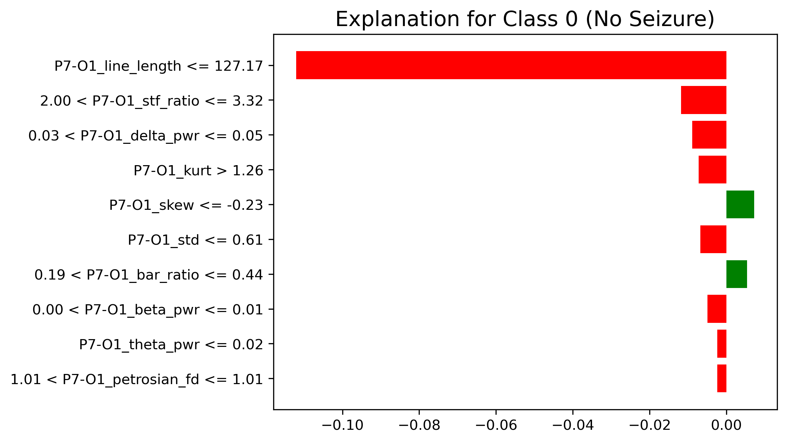

# Data and Models Selection
Since the amount of data and models used, we will select only 2 significant patients and we willl explain only the best models for each task.

1. [Methods used](#exaplainability-methods)
2. [Task 1](#seizure-detection)
3. [Task 2](#seizure-prediction)

## Exaplainability methods
To ensure the transparency and clinical reliability of our diagnostic models, we employed a **dual-layer interpretability framework**.

* **SHAP (SHapley Additive exPlanations)**: This methods allow to capture global feature importance across the entire dataset, identifying which EEG biomarkers consistently drive the model’s decisions

* **LIME (Local Interpretable Model-agnostic Explanations)**: This method is used for granular, case-specific analysis of individual ictal (seizure) and inter-ictal (normal) events, bridging the gap between machine learning predictions and neurological observations.

## Seizure detection
[Notebook](../notebooks/models_task01/interpretability.ipynb)

In this initial task, our analysis focused specifically on patient `chb04`. A defining characteristic of this dataset is the significant class imbalance, with a high preponderance of inter-ictal (non-seizure) windows relative to ictal events. **The K-Nearest Neighbors (KNN)** algorithm emerged as the top-performing model for this patient. Given that the selected test set consisted exclusively of non-seizure activity, our interpretability analysis is focused on validating the model's logic in correctly identifying and dismissing these inter-ictal windows.

The KNN model is extremely confident in assigning a 100% of probability that in the window there is not a seizure present. `P7-01_line_lenght` is the most influential feature, that strongly drive the decision to be a **Non seizure**. In fact, lowe line length indicates a calmer signal state, without high frequency that usually refer to the presence of a Seizure. The overconfidence in labeling the windows as a non seizure is caused by the big amount of non seizure windows.

## Seizure prediction
[Notebook](../notebooks/models_task02/interpretability.ipynb)

The second phase of our analysis focused on patient `chb12`. Unlike previous cases, this patient provided a higher frequency of seizure windows, which facilitated more robust training of our predictive models. Our evaluation revealed that the **Random Forest** (from the ensemble/advanced category) and the **Recurrent Neural Network** (from the deep learning category) were the leading performers. However, upon final comparison, the **Random Forest** ultimately outperformed the **RNN**, demonstrating superior accuracy and stability for this specific patient’s EEG profile, but still we wanted to understand what influence the decisions of a deep learning model.

Due to the significant computational complexity associated with these architectures—specifically the high dimensional feature space and the depth of the neural layers—executing the full suite of interpretability methods proved prohibitive within the available timeframes. Initial attempts to run the global attribution methods indicated that the processing time per instance exceeded practical limits of the machines that we currently use.